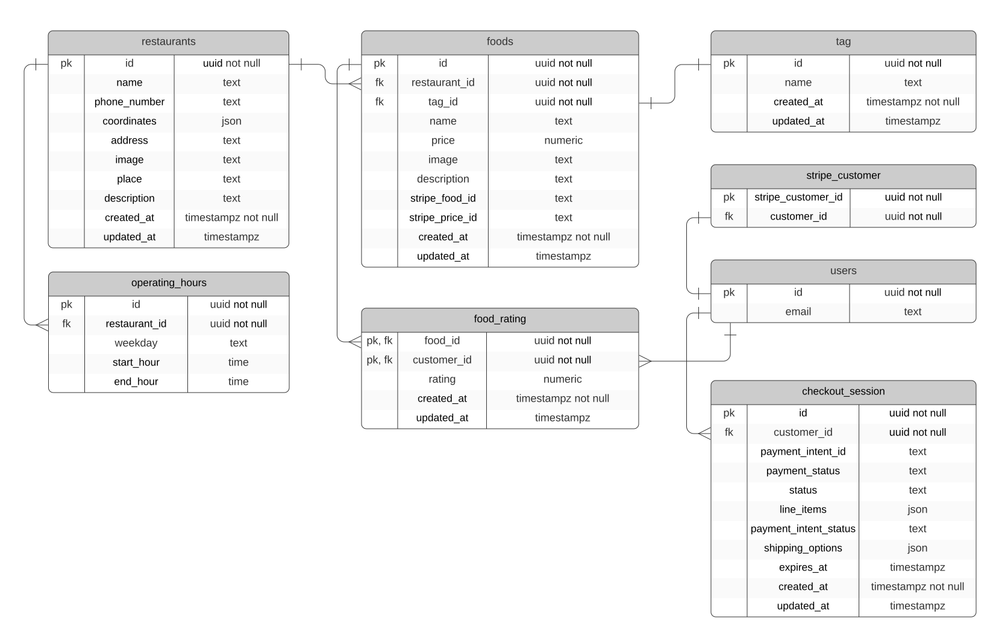

<p align="center">
    
</p>  

<p align="center">
  
</p>

<!-- TABLE OF CONTENTS -->

<h5 align="center">
<a href="#sobre">Sobre</a>
   •   <a href="#tecnologias">Tecnologias</a>
   •   <a href="#funcionalidades">Funcionalidades</a>
   •   <a href="#instalação">Instalação</a>
   •   <a href="#Publicação">Publicação</a>
   •   <a href="#agradecimento">Agradecimento</a>
   •   <a href="#licença">Licença</a>
   •   <a href="#autor">Autor</a>
</h5>

## Sobre

<h4>GoRestaurant é uma plataforma que oferece serviço de venda de alimentos pela internet com entrega ou retirada no local.</h4>

O usuário acessa a plataforma, seleciona um local para entrega, a plataforma oferece todos os restaurantes da sua região, o usuário escolhe sua comida favorita, fecha o pedido e então recebe a comida. Também temos um sistema de avaliação de comidas, mas para apenas usuários cadastrados e que já fizeram pedidos. A avaliação é um termômetro indicando os melhores restaurantes e comidas.

A criação desta plataforma foi inspirada nos serviços de entrega de alimentos online [Deliveroo](https://deliveroo.co.uk/), [Ubereats](https://www.ubereats.com/) e [Swiggy](https://www.swiggy.com/).

As imagens das comidas e dos restaurantes podem ser encontradas em [Unsplash](https://unsplash.com/) e [Pexels](https://www.pexels.com/).

## Tecnologias

* [TypeScript](https://www.typescriptlang.org/)
* [Next.js](https://nextjs.org/)
* [TailwindCSS](https://tailwindcss.com/)
* [clsx](https://github.com/lukeed/clsx)
* [Radix-ui](https://www.radix-ui.com/)
* [Supabase](https://supabase.io/)
* [Stripe](https://stripe.com/br)
* [Mapbox](https://www.mapbox.com/)
* [Ngeohash](https://www.npmjs.com/package/ngeohash)
* [Axios](https://www.npmjs.com/package/axios)
* [Nookies](https://www.npmjs.com/package/nookies)
* [TanStack Query](https://tanstack.com/)
* [React Hook Form](https://react-hook-form.com/)
* [Zod](https://zod.dev/)
* [React Hot Toast](https://react-hot-toast.com/)
* [Scroll into view](https://www.npmjs.com/package/scroll-into-view)
* [Lodash.debounce](https://www.npmjs.com/package/lodash.debounce)
* [Phosphor icons](https://phosphoricons.com/)
* [React responsive](https://github.com/yocontra/react-responsive)
* [React scroll parallax](https://react-scroll-parallax.damnthat.tv/docs/intro)
* [typewriter-effect](https://github.com/tameemsafi/typewriterjs)

> Veja o arquivo  [package.json](/package.json)

## Funcionalidades

<details open>
  <summary>Responsividade para as larguras:</summary>

  * [x] 320px
  * [x] 360px
  * [x] 412px
  * [x] 640px
  * [x] 768px
  * [x] 1024px
  * [x] 1280px
  * [x] 1366px
  * [x] 1440px
</details>

<details open>
  <summary>Página inicial</summary>

  * [x] Dialog com breve apresentação do projeto, contatos pessoais e sites que inspiraram.
  * [x] Botão flutuante que abre um dialog contendo instruções que ajudam o usuário com as compras.
  * [x] O usuário poderá se cadastrar e iniciar/encerrar sessão na aplicação;
  * [x] Autocomplete ao digitar endereço de entrega;
  * [x] Obtenção do endereço, região, coordenadas e geohash no clique do usuário no mapa;
  * [x] Utilização de geohash ao redirecionar a localização obtida em uma página para outra;
    * [x] Obtenção das informações de localização a partir do geohash.
  * [x] Visualização de todos os restaurantes em um mapa;
    * [x] O clique em um restaurante no mapa mostra um pop-up com todas as informações relevantes do restaurante.
  * [x] Rodapé com links media sociais do projeto e quem o construiu.
</details>

<details open>
  <summary>Página dos restaurantes</summary>

  * [x] Criação de sidebar onde o usuário poderá ordenar e filtrar os restaurantes, optar se quer entrega ou retirada e permitir a troca de localização;
    * A filtragem ocorre sobre o preço de entrega se o usuário optou por entrega e sobre categorias de comida.
    * A ordenação ocorre de modo decrescente por avaliação geral de cada restaurante ou por tempo de entrega.
  * [x] Listagem de todos os restaurantes baseados na filtragem e na região do endereço de entrega;
  * [X] Cada filtro escolhido será mostrado acima da lista de restaurantes permitindo ao usuário um melhor gerenciamento da filtragem;
  * [X] Cada card de restaurante conterá seu nome, sua imagem, algumas das categorias de comidas, sua avaliação geral, tempo de entrega ou retirada, e preço de entrega.
</details>

<details open>
  <summary>Página de um restaurante específico</summary>
  
  * [x] Navegação entre página inicial e página de listagem de retaurantes com base na região do especificado;
  * [X] Visualização do nome, imagem, descrição, telefone e algumas categorias de suas comidas disponíveis do restaurante;
  * [x] Horário de funcionamento e status de aberto/fechado;
  * [x] Permitir a troca de localização do usuário apenas para a região do restaurante;
  * [x] Mostrar localização do restaurante em um mapa não interagível;
  * [x] Mostrar todas as comidas disponíveis, dividas por seção e com navegação entre as seções;
  * [x] Adicionar/Remover comidas ao carrinho
  * [x] No carrinho, permitir também adicionar/remover as comidas além de permitir a criação de uma sessão de checkout para realizar o pagamento.
  * [x] A sessão de checkout será uma sessão do Stripe. Ao realizar o pagamento o usuário é redirecionado para a página inicial.
</details>

<details open>
  <summary>Página do painel de controle</summary>

  * Apenas usuários cadastrados podem acessar essas páginas.
    * [x] Página de configurações que permite a exclusão de conta;
    * [x] Página de avaliações que permite a avaliação de comidas quando um pagamento foi concluído;
    * [x] Página de pagamentos que permite visualizar o status de todos os pagamentos realizados.
</details>

## Instalação

* ### **Pré-requisitos**

  * É **necessário** possuir o **[Git](https://git-scm.com/)** instalado e configurado no computador.
  * É **necessário** ter um gerenciador de pacotes seja o **[NPM](https://www.npmjs.com/)** ou **[Yarn](https://yarnpkg.com/)**.
  * É **necessário** ter uma conta no mapbox.
  * É **necessário** ter uma conta na stripe.
  * É **necessário** ter uma conta no supabase.

* ### **Próximo passo**

1. Faça um clone deste repositório:

   ```bash
   git clone https://github.com/die-goncalves/go-restaurant.git
   ```

2. Instale as depêndencias:

   ```bash
   # Entre no diretório do repositório clonado
   $ cd go-restaurant
   # Instale as dependências do projeto.
   $ yarn #ou $ npm install
   ```

3. Crie na raiz do projeto o arquivo **.env.local**.

    ```bash
    # .env.local
    # STRIPE
    NEXT_PUBLIC_STRIPE_WEBHOOK_SECRET=
    NEXT_PUBLIC_STRIPE_API_KEY=
    NEXT_PUBLIC_STRIPE_PUBLIC_KEY=
    NEXT_PUBLIC_STRIPE_SUCCESS_URL=
    NEXT_PUBLIC_STRIPE_CANCEL_URL=
    # MAPBOX
    NEXT_PUBLIC_MAPBOX_TOKEN=
    # SUPABASE
    NEXT_PUBLIC_SUPABASE_URL=
    NEXT_PUBLIC_SUPABASE_ANON_KEY=
    NEXT_PUBLIC_SUPABASE_SERVICE_ROLE_SECRET_KEY=
    ```

    <p align="center" style="font-style:italic;text-decoration: underline;">Stripe</p>
    
    * Cadastre-se na Stripe;
    * Crie uma conta empresa;
    * ***Importante: Utilize no modo teste***;
      * Adicione as comidas deste [arquivo](/assets/foods.txt) clicando em [`Produtos`](https://dashboard.stripe.com/test/products?active=true). Em detalhes do produto coloque apenas o nome, em detalhes do preço coloque o preço e clique em `uma única vez`
        * Copie o id do produto e do preço de cada comida adicionada para editar o banco de dados posteriormente.
      * **Chaves**:
        * [Clique em `Desenvolvedores`, em seguida em `Chaves da API` na sidebar](https://dashboard.stripe.com/test/apikeys):
        **NEXT_PUBLIC_STRIPE_PUBLIC_KEY** - Chave publicável
        **NEXT_PUBLIC_STRIPE_API_KEY** - Chave secreta  
        * Como estamos em modo de desenvolvimento usaremos a [Stripe CLI](https://stripe.com/docs/stripe-cli) para ouvir eventos do fluxo de pagamentos. Siga [este tutorial](https://stripe.com/docs/stripe-cli/webhooks) para encaminhar os eventos para sua aplicação. Você receberá a chave **NEXT_PUBLIC_STRIPE_WEBHOOK_SECRET** quando executar `stripe listen --forward-to localhost:3000/stripe_webhooks`.  
        * Estas variáveis você define: **NEXT_PUBLIC_STRIPE_SUCCESS_URL** é a rota da página que o usuário é redirecionado ao realizar uma compra. E **NEXT_PUBLIC_STRIPE_CANCEL_URL** é a rota da página que o usuário é redirecionado ao cancelar uma compra.

    <p align="center" style="font-style:italic;text-decoration: underline;">Mapbox</p>

    * Cadastre-se no Mapbox;
    * **Chave**:
        * Clique em [`tokens`](https://account.mapbox.com/access-tokens/) em sua conta , você pode criar novo token ou utilizar o token padrão. Copie o token em **NEXT_PUBLIC_MAPBOX_TOKEN**

    <p align="center" style="font-style:italic;text-decoration: underline;">Supabase</p>

    * Cadastre-se no Supabase;
    * Crie um projeto;
    * Copie o [banco de dados](/assets/supabaseData.sql), modifique cada `insert into foods` colocando o id do produto e do preço copiado anteriormente no lugar de `id_produto_stripe` e `id_preco_produto_stripe`, clique em `SQL Editor` na sidebar, em seguida crie uma nova query em `New query` e execute o conteúdo copiado.
    * **Chaves**:
      * Clique em `Project settings` na sidebar, clique em `API` e você encontrará as chaves `URL`, `anon` e `service_role`. Você pode seguir este [guia](https://supabase.com/docs/guides/getting-started/tutorials/with-nextjs#get-the-api-keys).
    * Diagrama ER de banco de dados (pé de galinha):
    

4. Execute a aplicação

    ```bash
    # Em um terminal
    $ yarn dev #ou $ npm run dev
    # A aplicação inciará na porta:3000 - acesse <http://localhost:3000>
    ```

    ```bash
    # Em outro terminal
    $ stripe listen --forward-to localhost:3000/stripe_webhooks
    # Lembrando que a chave STRIPE_WEBHOOK_SECRET tem que ser a mesma que aparece ao executar este comando.
    ```

## Publicação

[](http://go-restaurant-by-die-goncalves.vercel.app/)

### Visão do projeto

|  |  |
|:----:|:----:|
|  320px  | 1440px |

## Agradecimento

|  | 
|----|
|<a href="https://rocketseat.com.br/"><sub><b>Rocketseat</b></sub></a>|

## Licença

Esse projeto está sob a licença MIT. Veja o arquivo [LICENSE](LICENSE) para mais detalhes.

## Autor

Feito por Diego Gonçalves, contato:

[](https://www.linkedin.com/in/diego-goncalves1990)
[](mailto:die.goncalves1990@gmail.com)
